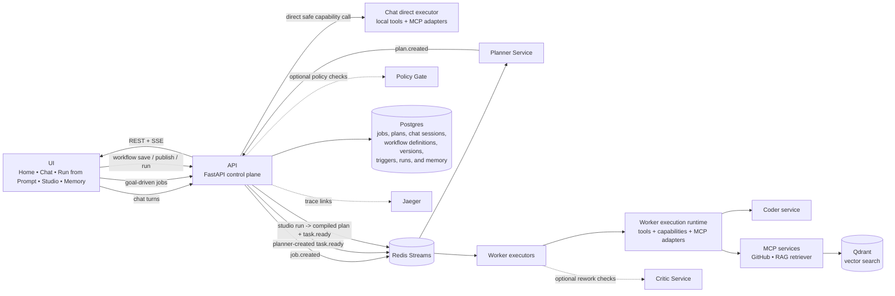

# Agentic Workflow Studio

Agentic Workflow Studio is a full-stack platform for authoring and running AI-powered workflows through chat and a visual DAG editor, backed by typed execution contracts, reusable capabilities, memory, triggers, and Kubernetes-native orchestration.

---

## Quick Start — Docker Compose

**Prerequisites:** Docker Desktop or Docker Engine with Docker Compose.

**1. Set up environment**

```bash
cp .env.example .env
```

Set at minimum in `.env`:

```bash
OPENAI_API_KEY=<your-key>
OPENAI_MODEL=<your-model>   # e.g. gpt-4o
```

Docker Compose runs the planner and worker in OpenAI-backed LLM mode, so these credentials are required for a functional local stack. GitHub capabilities are not included in the default Compose stack (`github-mcp` is omitted).

**2. Start the stack**

```bash
make up
```

**3. Open the app**

| Service | URL |
|---|---|
| UI | http://localhost:3002 |
| API | http://localhost:18000 |
| API docs | http://localhost:18000/docs |

---

**Quality checks** (requires `uv` — no manual dependency install needed)

```bash
make test
make lint
make typecheck
make eval-intent
make eval-capability-search
make eval-chat-boundary
```

---

## Quick Start — Local Kubernetes (Docker Desktop)

**Prerequisites:** Docker Desktop with Kubernetes enabled.

**1. Set up environment**

```bash
cp .env.example .env
```

Set at minimum in `.env`:

```bash
OPENAI_API_KEY=<your-key>
OPENAI_MODEL=<your-model>   # e.g. gpt-4o
```

**2. Build, push, and deploy**

```bash
make k8s-up-local
```

This one command:
- Starts a local registry at `localhost:5001` if not already running
- Builds all service images and pushes them to the local registry
- Applies Kubernetes manifests from `deploy/k8s/overlays/local`
- Syncs `.env`-backed secrets and config into the cluster
- Pins image tags and waits for all deployments to roll out

**3. Forward ports**

Open separate terminals (or use `&`) for the services you need:

```bash
# Required — API and UI
kubectl port-forward -n awe svc/api 18000:8000
kubectl port-forward -n awe svc/ui  8510:80

# Optional — observability and supporting services
kubectl port-forward -n awe svc/coder      18001:8000
kubectl port-forward -n awe svc/grafana    3000:3000
kubectl port-forward -n awe svc/jaeger     16686:16686
kubectl port-forward -n awe svc/prometheus 9090:9090
```

**4. Open the app**

| Service | URL |
|---|---|
| UI | http://localhost:8510 |
| API | http://localhost:18000 |
| API docs | http://localhost:18000/docs |
| Grafana | http://localhost:3000 |
| Jaeger | http://localhost:16686 |

---

**Follow-up targets**

| Target | When to use |
|---|---|
| `make k8s-apply-local` | Re-apply manifests and refresh cluster config from `.env` |
| `make k8s-restart-local` | Restart app pods after env/config changes (no rebuild) |
| `make k8s-down-local` | Delete app deployments; Postgres and Redis PVCs are preserved |
| `make k8s-apply-observability` | Deploy Prometheus + Grafana + Loki dashboards |

To rebuild and redeploy a single service after a code change (e.g. the UI):

```bash
NEW_TAG="local-$(date +%Y%m%d%H%M%S)"
IMAGE_REGISTRY=localhost:5001 IMAGE_OWNER=localhost IMAGE_TAG="${NEW_TAG}" ./scripts/docker_images.sh build
IMAGE_REGISTRY=localhost:5001 IMAGE_OWNER=localhost IMAGE_TAG="${NEW_TAG}" ./scripts/docker_images.sh push
kubectl set image deployment/ui -n awe ui="localhost:5001/localhost/awe-ui:${NEW_TAG}"
kubectl rollout status deployment/ui -n awe
```

---

## Business Objective

Agentic Workflow Studio helps organizations turn AI-assisted work from ad hoc prompt experiments into governed, repeatable business workflows. The platform reduces the time required to design, approve, run, and audit complex knowledge-work processes by combining conversational intake, reusable capabilities, visual workflow authoring, and production-grade execution controls.

The platform is intended to:

- Accelerate delivery of AI-enabled internal tools, operational workflows, and document/report generation processes.
- Improve reliability and accountability by making plans, tool calls, approvals, memory usage, artifacts, and outcomes traceable.
- Reduce duplicated one-off agent development through reusable capabilities, typed contracts, and common runtime services.
- Support safer adoption of AI automation with policy gates, execution governance, feedback analytics, and observable runs.
- Enable teams to move from prototype workflows to production-style deployments across local and Kubernetes environments.

For online metrics, success criteria, and ROI calculations see [docs/feedback-model-optimization-playbook.md](docs/feedback-model-optimization-playbook.md).

---

## Agentic Pattern

This project uses a hybrid **agentic execution** pattern with three user-facing execution lanes:

1. **Planner-led jobs**: the planner creates a typed task DAG from a goal for goal-driven work.
2. **Direct chat execution**: chat can answer normally or invoke a single safe read-only capability when no durable workflow is needed.
3. **Studio-authored workflows**: manually designed workflow versions and triggers compile and run directly without planner involvement.

Operationally this is a control-plane/data-plane split with typed contracts, shared job context, and task output handoff across planner, chat, and workflow-studio paths.

Runtime components support those lanes:

- **API/UI** expose chat, job state, workflow runs, task outputs, streaming events, and downloadable artifacts.
- **Worker executors** run ready tasks with tool calls and capability adapters, including MCP-backed services.
- **Policy** can enforce execution governance and guardrails; **Critic** is an optional review/rework service but is not part of the default Kubernetes staging deployment.
- **Supporting services** such as coder, GitHub MCP, RAG retriever MCP, Qdrant, and Jaeger are deployed in Kubernetes environments that enable code, retrieval, vector search, and tracing workflows.

---

## Architecture

The platform has three user-facing execution paths that converge on shared runtime and storage services:

- **Chat path**: stays conversational by default, or executes one safe read-only capability directly when no durable workflow is needed.
- **Planner-led path**: accepts a goal, emits `job.created`, lets the planner build a task DAG, and dispatches ready tasks to workers.
- **Studio path**: saves and publishes manually authored workflow versions, then runs them directly through triggers or `Run Workflow` without planner involvement.



If your Markdown viewer does not support Mermaid, use this fallback:

```text
UI -> API
  - chat turns can stay conversational or execute one safe read-only capability directly in the API
  - goal-driven jobs emit job.created to Redis, then Planner returns a typed plan to the API
  - Studio workflow versions and triggers run directly from the API without planner involvement

API -> Redis Streams -> Worker executors
API -> Postgres (jobs, plans, chat sessions, workflow definitions, versions, triggers, runs, memory)
API -> UI (REST + SSE)
Planner -> API
Policy is deployed as the policy gate; Critic is an optional review/rework service
Worker execution can call supporting coder, GitHub MCP, and RAG retriever MCP services
Qdrant backs vector retrieval; Jaeger provides trace navigation
```

Related design docs:

- [`docs/target-architecture.md`](docs/target-architecture.md)
- [`docs/intent-planning-tool-calling-architecture.md`](docs/intent-planning-tool-calling-architecture.md)
- [`docs/intent-normalization-architecture.md`](docs/intent-normalization-architecture.md)
- [`docs/intent-normalization-implementation-plan.md`](docs/intent-normalization-implementation-plan.md)
- [`docs/user-feedback-implementation-plan.md`](docs/user-feedback-implementation-plan.md)
- [`docs/user-feedback-analytics-implementation-plan.md`](docs/user-feedback-analytics-implementation-plan.md)
- [`docs/feedback-model-optimization-playbook.md`](docs/feedback-model-optimization-playbook.md)
- [`docs/top-companies-intent-planning-patterns.md`](docs/top-companies-intent-planning-patterns.md)
- [`docs/top-companies-intent-normalization-patterns.md`](docs/top-companies-intent-normalization-patterns.md)
- [`docs/top-companies-minimum-agent-capabilities.md`](docs/top-companies-minimum-agent-capabilities.md)

---

## Application Services

- `api`: control plane for chat, jobs, plans, workflow definitions/versions/triggers/runs, memory APIs, feedback APIs, downloads, and SSE
- `planner`: builds typed task DAGs for planner-led jobs
- `worker`: executes ready tasks through tool and capability runtimes, including memory-aware payload resolution
- `policy`: optional policy gate service
- `critic`: optional rework/review service; not part of the default Kubernetes staging deployment
- `coder`: MCP-backed coding service used by coding and repository workflows
- `github-mcp`: GitHub MCP server used when GitHub capabilities are enabled
- `rag-retriever-mcp`: retrieval service for RAG-backed workflows
- `qdrant`: vector database used by retrieval services
- `jaeger`: trace collection and navigation service
- `ui`: Next.js frontend for Home, Chat, Run from Prompt, Studio, Memory, and feedback insights

---

## Configuration

- Non-secret runtime variables are documented in `.env.example`.
- Keep secrets in `.env` only.
- Common non-secret configuration:
  - `OPENAI_MODEL`
  - `OPENAI_BASE_URL`
  - `PLANNER_MODE`
  - `WORKER_MODE`
  - `NEXT_PUBLIC_API_URL`
- Typical secrets:
  - `OPENAI_API_KEY`
  - `GITHUB_CLASSIC_TOKEN` preferred, with fallback to `GITHUB_TOKEN`
  - `AWS_ACCESS_KEY_ID`
  - `AWS_SECRET_ACCESS_KEY`

---

## LLM Planner and Worker Modes

Docker Compose runs planner and worker in LLM mode. Before `make up`, choose one provider contract.

For OpenAI:

```bash
LLM_PROVIDER=openai
OPENAI_MODEL=<model>
OPENAI_API_KEY=<key>
OPENAI_BASE_URL=https://api.openai.com
OPENAI_TEMPERATURE=
OPENAI_MAX_OUTPUT_TOKENS=
OPENAI_TIMEOUT_S=60
OPENAI_MAX_RETRIES=2
```

For an OpenAI fine-tuned model, keep `LLM_PROVIDER=openai` and set `OPENAI_MODEL` to the fine-tuned model ID.

For a fine-tuned or self-hosted model behind an OpenAI-compatible Chat Completions endpoint:

```bash
LLM_PROVIDER=openai_compatible
OPENAI_MODEL=<model>
OPENAI_API_KEY=<key>
OPENAI_BASE_URL=<chat-completions-compatible-base-url>
OPENAI_TIMEOUT_S=60
OPENAI_MAX_RETRIES=2
```

For Gemini:

```bash
LLM_PROVIDER=gemini
GEMINI_MODEL=gemini-2.5-flash
GEMINI_API_KEY=<key>
GEMINI_BASE_URL=https://generativelanguage.googleapis.com/v1beta/openai
OPENAI_TIMEOUT_S=60
OPENAI_MAX_RETRIES=2
```

In Docker Compose, `planner` and `worker` modes are fixed by `docker-compose.yml` as `PLANNER_MODE=llm` and `WORKER_MODE=llm`; `LLM_PROVIDER` selects OpenAI, Gemini, or mock provider behavior.

The API also supports narrower model knobs for chat and intent paths:

```bash
CHAT_ROUTER_MODEL=<model>
CHAT_RESPONSE_MODEL=<model>
CHAT_PENDING_CORRECTION_MODEL=<model>
CHAT_CLARIFICATION_NORMALIZER_MODEL=<lighter-model>
INTENT_ASSESS_MODEL=<model>
INTENT_DECOMPOSE_MODEL=<model>
```

Use those knobs when you want to swap or fine-tune only one subsystem instead of changing the entire stack-wide `OPENAI_MODEL`. See [Feedback, Evaluation, and Fine-Tuning Playbook](docs/feedback-model-optimization-playbook.md) for the recommended rollout pattern.

---

## Tooling Architecture

Tool assembly is coordinated through `libs/core/tool_bootstrap.py`, with responsibilities split by concern:

- `libs/core/tool_bootstrap.py`: builds service-specific tool registries from catalog, plugins, and governance rules
- `libs/core/tool_catalog.py`: built-in tool catalog and handler registration
- `libs/core/tool_plugins.py`: dynamic plugin discovery and loading
- `libs/core/tool_governance.py`: tool allowlists and governance enforcement
- `libs/core/tool_registry.py`: compatibility layer and default handler wiring
- `libs/framework/tool_runtime.py`: shared tool execution runtime (schema validation, timeout, error classification)
- `libs/tools/core_ops.py`: filesystem/workspace/search/render/core utility tools
- `libs/tools/llm_tool_groups.py`: grouped LLM tool registration specs
- `libs/tools/document_spec_llm.py`: DocumentSpec generation/repair/improvement tools
- `libs/tools/document_spec_iterative.py`: iterative DocumentSpec generation loops
- `libs/tools/openapi_iterative.py`: iterative OpenAPI spec generation loops
- `libs/tools/mcp_client.py`: MCP transport, retry, timeout budget, process/thread isolation
- `libs/tools/coder_tools.py`: coding-agent request/plan/step execution logic

### Plug-and-Play Tool Loading

`tool_bootstrap.build_default_registry(...)` supports dynamic plugin loading and runtime tool filters:

- `TOOL_PLUGIN_MODULES`: comma-separated module specs loaded at startup.
  - Format: `module.path` (defaults to `register_tools`) or `module.path:callable_name`.
  - Callable contract: `register_tools(registry, ...)` (first arg must be registry).
- `TOOL_PLUGIN_DISCOVERY_ENABLED=true` enables Python entry-point discovery.
- `TOOL_PLUGIN_ENTRYPOINT_GROUP` sets the entry-point group (default: `awe.tools`).
- `TOOL_PLUGIN_FAIL_FAST=true|false` controls startup behavior on plugin load failure.
- `ENABLED_TOOLS`: optional allowlist of final tool names.
- `DISABLED_TOOLS`: optional denylist of final tool names.
- Per-service allow/deny:
  - `PLANNER_ENABLED_TOOLS` / `PLANNER_DISABLED_TOOLS`
  - `WORKER_ENABLED_TOOLS` / `WORKER_DISABLED_TOOLS`
  - `API_ENABLED_TOOLS` / `API_DISABLED_TOOLS`
  - Deny wins over allow.
- Governance policy config:
  - `TOOL_GOVERNANCE_ENABLED=true|false`
  - `TOOL_GOVERNANCE_MODE=enforce|dry_run`
  - `TOOL_GOVERNANCE_CONFIG_PATH=config/tool_governance.yaml`
  - Supports global/service/tenant/job_type rules and risk-level blocks.

Example:

```bash
TOOL_PLUGIN_MODULES=my_tools.my_plugin
ENABLED_TOOLS=llm_generate,my_custom_tool
DISABLED_TOOLS=sleep
WORKER_DISABLED_TOOLS=run_tests,workspace_write_code
```

In `dry_run`, violations are logged (`tool_governance_violation_dry_run`) but not blocked.

### Capability Governance and Contracts

Capability execution has separate controls so capabilities can be governed independently from local tools across worker execution and direct chat execution:

- `CAPABILITY_MODE=disabled|dry_run|enabled`
- `CAPABILITY_REGISTRY_PATH=config/capability_registry.yaml`
- `CAPABILITY_GOVERNANCE_ENABLED=true|false`
- `CAPABILITY_GOVERNANCE_MODE=enforce|dry_run`
- `ENABLED_CAPABILITIES` / `DISABLED_CAPABILITIES`
- Per-service allow/deny:
  - `WORKER_ENABLED_CAPABILITIES` / `WORKER_DISABLED_CAPABILITIES`
  - `API_ENABLED_CAPABILITIES` / `API_DISABLED_CAPABILITIES`
  - other normalized service names follow the same pattern
- Runtime input contract enforcement:
  - `CAPABILITY_INPUT_VALIDATION_ENABLED=true|false`
  - `CAPABILITY_ENFORCE_SCHEMA_PROPERTIES=true|false`

When enabled, capability payloads are validated against the capability input schema and can be pruned to declared top-level properties before execution.
In `dry_run`, capability violations are logged (`capability_governance_violation_dry_run`) and execution continues.

In-repo template:

- `plugins/example_tool_plugin.py`
- load with `TOOL_PLUGIN_MODULES=plugins.example_tool_plugin`

---

## Key Make Targets

| Target | What it does |
|---|---|
| `make up` | Start the full Docker Compose stack |
| `make down` | Stop and remove Docker Compose containers |
| `make up-workers` | Start only the worker services |
| `make test` | Run the Python test suite via uv |
| `make lint` | Run ruff linter via uv |
| `make typecheck` | Run mypy type checks via uv |
| `make format` | Auto-format Python source with ruff |
| `make schemas` | Regenerate JSON schemas from Python models |
| `make images-list` | List all service image names and tags |
| `make images-build` | Build all service Docker images |
| `make images-push` | Push built images to the configured registry |
| `make k8s-up-local` | Full local k8s setup: build, push, apply, roll out |
| `make k8s-apply-local` | Re-apply local manifests and refresh cluster config |
| `make k8s-restart-local` | Restart all app pods without rebuilding |
| `make k8s-down-local` | Delete app deployments (Postgres/Redis PVCs preserved) |
| `make k8s-up-staging` | Deploy to the staging namespace |
| `make k8s-up-production` | Deploy to the production namespace |
| `make k8s-apply-observability` | Deploy Prometheus + Grafana + Loki |
| `make k8s-sync-workspace` | Copy workspace files from cluster to local |
| `make k8s-sync-artifacts` | Copy artifact files from cluster to local |
| `make k8s-sync-shared` | Copy shared files from cluster to local |
| `make eval-intent` | Run intent decomposition gold-set eval |
| `make eval-intent-gate` | Run intent eval with pass/fail threshold |
| `make eval-capability-search` | Run capability search quality eval |
| `make eval-capability-search-gate` | Run capability search eval with threshold |
| `make eval-chat-boundary` | Run chat boundary routing gold-set eval |
| `make eval-chat-boundary-gate` | Run chat boundary eval with pass/fail threshold |
| `make eval-deepeval-chat` | Run DeepEval judge on chat quality |
| `make eval-deepeval-planner` | Run DeepEval judge on planner quality |
| `make eval-deepeval-gate` | Combined DeepEval gate with pass/fail threshold |
| `make eval-deepeval-staging-replay` | Replay staging feedback slices through DeepEval |

---

## CI/CD

The repo ships with a Docker plus Kubernetes GitHub Actions pipeline.

- CI: `.github/workflows/ci.yml`
- Staging release: `.github/workflows/release-staging.yml`
- Production promotion: `.github/workflows/promote-production.yml`
- Staging regression gate: `.github/workflows/staging-routing-gate.yml`

Setup details and required secrets are documented in [docs/cicd-pipeline.md](docs/cicd-pipeline.md).

---

## Intent Eval Harness

Use the gold-set harness to track intent decomposition quality over time.

Gold cases: `eval/intent_gold.yaml`

```bash
make eval-intent        # run locally
make eval-intent-gate   # CI gate with pass/fail threshold
```

## Chat Boundary Eval Harness

Use the gold-set harness to keep `response_first` chat boundary behavior stable as routing rules evolve.

Gold cases: `eval/chat_boundary_gold.yaml`

```bash
make eval-chat-boundary        # run locally
make eval-chat-boundary-gate   # CI gate with pass/fail threshold
```

Run a live staging-style regression against an API environment:

```bash
CHAT_BOUNDARY_LIVE_BASE_URL=https://staging.example.internal \
CHAT_BOUNDARY_LIVE_BEARER_TOKEN=... \
CHAT_BOUNDARY_LIVE_MIN_PASS_RATE=1.0 \
make eval-chat-boundary-live
```

GitHub Actions staging gate: `.github/workflows/staging-routing-gate.yml` — supports `workflow_dispatch` and `workflow_call`, uploads `artifacts/evals/chat_boundary_live_report.json`.

Build routing calibrator artifacts from an API environment:

```bash
CHAT_ROUTING_FEEDBACK_BASE_URL=https://staging.example.internal \
CHAT_ROUTING_FEEDBACK_BEARER_TOKEN=... \
CHAT_ROUTING_FEEDBACK_LIMIT=5000 \
CHAT_ROUTING_CALIBRATOR_MIN_EXAMPLES=10 \
make build-chat-routing-calibrator-from-api
```

Router calibration controls:

- `CHAT_ROUTING_CALIBRATOR_ENABLED=true`
- `CHAT_ROUTING_CALIBRATOR_LIVE=false`
- `CHAT_ROUTING_CALIBRATOR_MIN_PROBABILITY=0.65`
- `CHAT_ROUTING_CALIBRATOR_MIN_MARGIN=0.08`

## DeepEval Agent Gates

DeepEval runs as a second evaluation layer for `chat + planner` without replacing the existing repo-native gold-set gates.

```bash
make eval-deepeval-chat
make eval-deepeval-planner
make eval-deepeval-gate
```

Replay staging feedback slices:

```bash
DEEPEVAL_STAGING_BASE_URL=https://staging.example.internal \
DEEPEVAL_STAGING_BEARER_TOKEN=... \
make eval-deepeval-staging-replay
```

Core controls:

- `DEEPEVAL_ENABLED=false`
- `DEEPEVAL_MODE=local`
- `DEEPEVAL_JUDGE_PROVIDER=mock`
- `DEEPEVAL_JUDGE_MODEL=...`
- `DEEPEVAL_JUDGE_API_KEY=...`
- `DEEPEVAL_MIN_CHAT_SCORE=0.95`
- `DEEPEVAL_MIN_PLANNER_SCORE=0.90`

When `DEEPEVAL_ENABLED=false` or `DEEPEVAL_JUDGE_PROVIDER=mock`, the harness writes normalized reports using deterministic local metrics. When `DEEPEVAL_ENABLED=true` with a real judge provider, it adds DeepEval judge metrics on top.

---

## Kubernetes

Kubernetes manifests live under `deploy/k8s`.

- Baseline deployments/services for app + data services
- Optional KEDA scaler for worker queue depth
- Optional observability stack (Prometheus/Grafana/Loki/Jaeger)

See full deployment details in [deploy/k8s/README.md](deploy/k8s/README.md).

For staging and production:

```bash
make k8s-up-staging      # deploy to staging namespace
make k8s-up-production   # deploy to production namespace
```

---

## Observability

- **Metrics**: API exposes `/metrics`; planner, worker, policy, and coder also expose Prometheus endpoints. Key metric families:
  - Jobs and orchestration: `jobs_created_total`, `orchestrator_loop_errors_total`
  - Intent quality: `intent_assessments_total`, `intent_decompose_requests_total`, `intent_clarification_required_total`
  - Capability discovery: `capability_search_requests_total`, `capability_execution_outcomes_total`
  - Feedback: `feedback_submitted_total`, `feedback_reason_total`, `feedback_examples_export_total`
  - Chat routing: `chat_boundary_decisions_total`, `chat_routing_feedback_total`

- **Tracing**: OTLP tracing via `OTEL_EXPORTER_OTLP_ENDPOINT`; trace IDs are surfaced through task/job runtime data and linked from the UI debugger.

- **Observability stack** (Prometheus + Grafana + Loki + prebuilt dashboards):

```bash
make k8s-apply-observability
```

Jaeger is deployed separately in the base Kubernetes manifests and port-forwarded independently (`svc/jaeger 16686:16686`).

---

## Worker Reliability and Scaling

Workers consume `task.ready` from Redis Streams consumer group `workers`.

- Retry policy: `WORKER_RETRY_POLICY=transient|any|none`
- Stale pending recovery: `WORKER_RECOVER_*`
- Dead-letter stream: `tasks.dlq` when `WORKER_DLQ_ENABLED=true`
- Retry failed tasks: `POST /jobs/{job_id}/tasks/{task_id}/retry`
- Retry all failed tasks: `POST /jobs/{job_id}/retry_failed`
- Base Kubernetes scaling options:
  - CPU HPA: `deploy/k8s/hpa-worker.yaml`
  - Queue-depth autoscaling with KEDA: `deploy/k8s/keda-worker-scaledobject.yaml`
- Multi-worker filesystem execution expects shared storage that supports `ReadWriteMany` for the `shared-data` PVC.
- Queue-depth scaling follows Redis Stream backlog for `tasks.events` and consumer group `workers`.

---

## Artifact and Document Storage

### Filesystem mode

- `DOCUMENT_STORE_BACKEND=filesystem`
- Artifact files are written under `ARTIFACTS_DIR` (default `/shared/artifacts`)
- API artifact downloads in filesystem mode require the API service to have access to the same shared artifact volume
- The local Kubernetes overlay mounts `/shared` into both `worker` and `api`; the base Kubernetes manifests do not

### S3/object store mode

- `DOCUMENT_STORE_BACKEND=s3`
- Required: `DOCUMENT_STORE_S3_BUCKET`
- Optional: `DOCUMENT_STORE_S3_PREFIX`, `DOCUMENT_STORE_S3_ENDPOINT`, `DOCUMENT_STORE_S3_REGION`

In S3 mode, workers upload artifact files after generation and API artifact download falls back to object store if the local file is not found.

Artifact download endpoint: `GET /artifacts/download?path=<relative_path>`

Workspace download endpoint: `GET /workspace/download?path=<relative_path>` — always served from shared workspace storage, does not fall back to S3.

---

## Chat, Memory, and Feedback

- Chat remains conversational by default, but it can also surface assistant-visible capabilities, answer scoped capability questions such as "what can you do related to GitHub?", and hand off to a safe direct capability when appropriate.
- Chat sessions can bind a server-derived user identity when present, hydrate exact `user_profile` memory, and write safe profile updates without trusting client-provided `user_id` fields.
- Long-term memory stays split by purpose:
  - `user_profile` for exact structured preferences
  - `semantic_memory` for reusable facts and patterns
  - `interaction_summaries` / `interaction_summaries_compact` for compact conversation summaries
- The UI captures explicit feedback on chat messages, intent understanding, generated plans, and final job outcomes.
- Operators can use:
  - `GET /feedback/summary` for aggregate rates and breakdowns
  - `GET /feedback/examples` for negative/partial example export
  - `GET /feedback/chat-boundary/review` for a lightweight queue of likely boundary misroutes
  - the Feedback Insights panel in the UI for quick operational review

---

## API Quick Reference

Assume the API is available at `http://localhost:18000`.

### Jobs

```bash
# Create a job
curl -X POST http://localhost:18000/jobs \
  -H "Content-Type: application/json" \
  -d '{"goal":"Generate an implementation checklist and artifact summary","context_json":{},"priority":1}'

# List jobs
curl http://localhost:18000/jobs

# Job details and tasks
curl http://localhost:18000/jobs/<job_id>/details
curl http://localhost:18000/jobs/<job_id>/tasks
```

- `POST /jobs/{job_id}/replan`
- `POST /jobs/{job_id}/cancel`
- `POST /jobs/{job_id}/continue`
- `POST /jobs/{job_id}/retry`
- `POST /jobs/{job_id}/retry_failed`
- `POST /jobs/{job_id}/tasks/{task_id}/retry`
- `GET /jobs/{job_id}/debugger`
- `GET /jobs/{job_id}/tasks/dlq`
- `GET /artifacts/download?path=<relative_path>`

### Chat

```bash
# Create a session
curl -X POST http://localhost:18000/chat/sessions \
  -H "Content-Type: application/json" \
  -d '{"title":"Workspace assistant"}'

# Send a turn
curl -X POST http://localhost:18000/chat/sessions/<session_id>/messages \
  -H "Content-Type: application/json" \
  -d '{"content":"List the workspace files","context_json":{},"priority":0}'
```

- `GET /chat/sessions/{session_id}`
- `GET /chat/sessions/{session_id}/feedback`

### Workflows

```bash
# Create a workflow definition
curl -X POST http://localhost:18000/workflows/definitions \
  -H "Content-Type: application/json" \
  -d '{"title":"Document pipeline","goal":"Generate and render a document","draft":{},"context_json":{},"user_id":"<your-user-id>"}'

# Publish and run
curl -X POST http://localhost:18000/workflows/definitions/<definition_id>/publish \
  -H "Content-Type: application/json" \
  -d '{}'

curl -X POST http://localhost:18000/workflows/versions/<version_id>/run \
  -H "Content-Type: application/json" \
  -d '{"inputs":{},"context_json":{},"priority":0}'
```

- `GET /workflows/definitions`
- `GET /workflows/definitions/{definition_id}`
- `PUT /workflows/definitions/{definition_id}`
- `GET /workflows/definitions/{definition_id}/versions`
- `POST /workflows/definitions/{definition_id}/triggers`
- `GET /workflows/definitions/{definition_id}/triggers`
- `PUT /workflows/triggers/{trigger_id}`
- `POST /workflows/triggers/{trigger_id}/invoke`
- `GET /workflows/definitions/{definition_id}/runs`

### Memory

```bash
# Write a user profile entry
curl -X POST http://localhost:18000/memory/write \
  -H "Content-Type: application/json" \
  -d '{"name":"user_profile","scope":"user","user_id":"<your-user-id>","key":"profile","payload":{"full_name":"Your Name"},"metadata":{"source":"manual"}}'

# Read memory
curl "http://localhost:18000/memory/read?name=user_profile&scope=user&user_id=<your-user-id>&key=profile"

# Semantic search
curl -X POST http://localhost:18000/memory/semantic/search \
  -H "Content-Type: application/json" \
  -d '{"query":"skills and certifications","namespace":"user_profile","user_id":"<your-user-id>"}'
```

- `GET /memory/specs`
- `DELETE /memory/delete?...`
- `POST /memory/semantic/write`

### Feedback

```bash
# Submit feedback
curl -X POST http://localhost:18000/feedback \
  -H "Content-Type: application/json" \
  -d '{"target_type":"chat_message","target_id":"<message_id>","sentiment":"negative","reason_codes":["missed_request"],"comment":"It ignored the main ask."}'

# Inspect aggregate feedback and export examples
curl "http://localhost:18000/feedback/summary?target_type=plan"

curl "http://localhost:18000/feedback/examples?target_type=chat_message&sentiment=negative&format=jsonl" \
  > eval/chat_feedback_negative.jsonl

curl "http://localhost:18000/feedback/chat-boundary/review?review_label=likely_false_chat_reply"
```

- `GET /feedback`
- `GET /feedback/summary`
- `GET /feedback/examples`
- `GET /feedback/chat-boundary/review`
- `GET /jobs/{job_id}/feedback`
- `GET /chat/sessions/{session_id}/feedback`

### Composer and Capabilities

```bash
curl -X POST http://localhost:18000/composer/compile \
  -H "Content-Type: application/json" \
  -d '{"draft":{"goal":"Draft workflow","nodes":[],"edges":[]}}'
```

- `POST /composer/recommend_capabilities`
- `GET /capabilities`
- `POST /capabilities/search`
- `POST /intent/clarify`
- `POST /intent/decompose`
- `POST /plans/preflight`

Canonical render capability IDs are `document.docx.render` and `document.pdf.render`. Raw `/plans/preflight` requires explicit caller-provided render paths; chat and Workflow Studio auto-derive them.

---

## Add a New Tool

1. Implement your tool module with `register_tools(registry, ...)`.
2. Register one or more `Tool` objects with `ToolSpec` + handler.
3. Load it through `tool_bootstrap.build_default_registry(...)` via `TOOL_PLUGIN_MODULES` (or entry points).
4. Verify service-level governance and allowlists so the new tool is visible where you expect it to run.
5. If the tool should be planner/chat/studio addressable as a capability, add or update its capability definition and schema refs in `config/capability_registry.yaml`.
6. Add/update tests in `libs/core/tests` and/or service tests.
7. Update planner prompts/tool usage guidance only if needed.

---

## Guides

- [User Guide](docs/user-guide.md)
- [API Guide](docs/api.md)
- [Architecture](docs/architecture.md)
- [AI Agents as Capabilities](docs/agent-capabilities.md)
- [RAG Playbook](docs/rag-playbook.md)
- [Semantic Memory](docs/semantic-memory.md)
- [Feedback, Evaluation, and Fine-Tuning Playbook](docs/feedback-model-optimization-playbook.md)

---

## Troubleshooting

- **UI connection errors**: verify the API port-forward is active on `localhost:18000` and the UI forward is active on your chosen local port. See `docs/k8s-port-forward.md`.
- **Artifact download not found**: confirm whether you are using shared-filesystem mode or S3/object-store fallback, and verify the file is visible to the API in the configured storage mode.
- **`ImagePullBackOff` in local Kubernetes**: use a fixed image tag, re-pin images, and restart rollouts. See `docs/runbook.md`.
- **Planner/worker behavior differs after env changes**: re-sync config/secrets and restart deployments with `make k8s-apply-local` or `make k8s-restart-local`.
